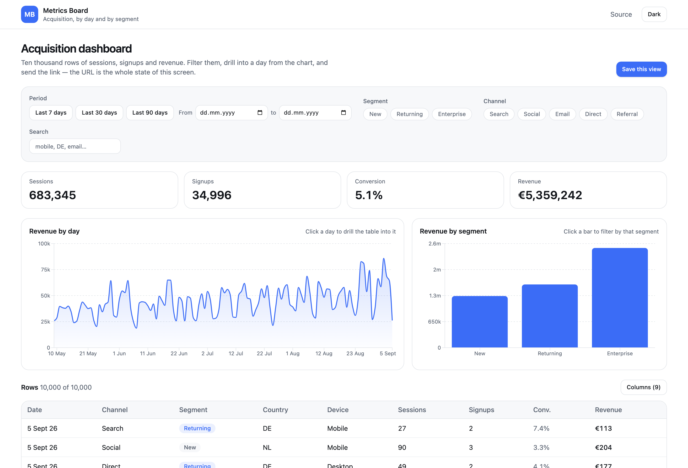
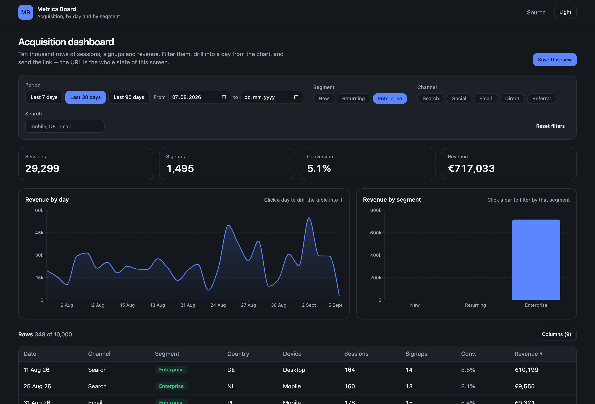

# Metrics Board

An acquisition dashboard over ten thousand rows: filter them, drill into a day
from the chart, and send someone the link — the URL is the entire state of the
screen.



## What it does

- **A table that does not flinch at 10,000 rows.** Sorting, column show/hide,
  reordering and drag-to-resize, a sticky header, and about thirty rows in the
  DOM at any moment. The column layout survives a reload.
- **Filters that live in the URL.** Period, segment, channel, free-text search,
  the day drilled into, and the sort — all of it is in the address bar as plain
  readable pairs (`?segments=enterprise&from=2026-08-07&sort=revenue&dir=desc`),
  so a link reproduces the screen exactly. Back and forward work like they
  should. A link with a broken parameter opens anyway, says which value it threw
  away, and leaves a clean URL behind.
- **Charts wired to the table in both directions.** Clicking a day drills the
  table into it; clicking a segment bar filters by that segment; the chips do
  the same thing from the other side. All three read one answer from the server,
  so the totals, the charts and the table cannot disagree about a number.
- **Saved views.** Name the filters and the column layout you keep coming back
  to, apply them in one click, rename or delete them (deleting asks first).



## The stack, and why

| | |
|---|---|
| Framework | React 19 + Vite |
| Routing | TanStack Router — typed search params validated with Zod |
| Data | TanStack Query — one query feeds the totals, both charts and the table |
| Table | TanStack Table v9 + TanStack Virtual |
| Charts | Recharts |
| Styling | Tailwind 4, tokens for light and dark |
| Mock API | MSW service worker over a seeded 10,000-row generator |
| Tests | Vitest + Testing Library, MSW in Node |

## What the TanStack pieces actually buy here

- **The router owns the filters, not a store.** `validateSearch` parses the
  query string with Zod and hands the page a typed object. There is no second
  copy of the filter state anywhere — no `useState` mirroring the URL, no
  effect syncing the two. Anything that changes a filter navigates.
- **Broken parameters are a normal case, not an error page.** Validation never
  throws: bad values are dropped, replaced with an explicit `undefined` (an
  omitted key would let the router merge the broken value straight back in), and
  reported to the person before the URL is quietly cleaned up.
- **`keepPreviousData` is why the screen does not blink.** Changing a filter
  keeps the previous answer on screen and dims it while the next one loads,
  instead of collapsing into skeletons on every keystroke. Skeletons are for the
  first load, when there is genuinely nothing to show.
- **Table v9 is composed, not configured.** The features a table uses —
  sorting, visibility, ordering, sizing, resizing — are passed in explicitly and
  the column definitions are typed against exactly those, so asking a column for
  `size` without the sizing feature is a compile error rather than a silent
  no-op. Nothing unused reaches the bundle.
- **Virtualization is the only reason the table is usable.** Ten thousand rows,
  a 400,000-pixel scroll height, and 25–38 `<tr>` elements in the DOM. It is a
  real `<table>`, so the header still means something to a screen reader.

Two things bit me, and both are commented where they were fixed. The virtualizer
subscribes to its scroll element in an effect, so it has to be held in state
rather than a ref, or it never learns the element exists. And MSW's worker URL
must be *resolved* against `document.baseURI` rather than concatenated onto it —
`baseURI` includes the query string, so every shared link (the whole point of
this project) failed to register the worker and started with a dead API.

## How this differs from the other React project in this portfolio

[`online-store`](https://github.com/MrNedNick/online-store) fetches a catalogue
with bare `fetch` and keeps the filters in component state. That is the right
size for a catalogue. This one exists to show the parts that only start to
matter when the data gets bigger and the screen gets shareable: a typed router
that owns the query string, a query cache that keeps the old answer visible
while the new one loads, and a virtualized table that does not slow down when
the dataset is a hundred times larger.

## Running it

```bash
npm install
npm run dev        # http://localhost:5173
```

```bash
npm run lint
npm test           # 23 tests
npm run build
```

Node 20.19+ or 22.12+.

## Tests

Twenty-three tests, all against the real code:

- the dataset generator — deterministic for a seed, and inside the bounds the
  UI claims;
- the selector — filtering, the day drill-down, and the invariant that the
  table, both charts and the totals always add up to the same number;
- search-parameter validation — good values through, broken ones dropped and
  reported, lists parsed from comma-separated form;
- the scenario through the UI with Testing Library and MSW: load, filter,
  confirm the URL, save a view, reload, and get the view back.

Both regressions introduced on purpose while writing them (a drill-down that
stopped filtering, and a dropped parameter that could be merged back in) were
caught by the suite.

CI runs lint → test → build on every push and pull request.

## Deploy

`vercel.json` is committed and the production build is verified locally:

```bash
npx vercel deploy --prod
```

There is no public link yet — the repository is private. Lighthouse on the local
production build (desktop preset) reports **100 performance / 100 accessibility
/ 100 best practices**, CLS 0.

## Known limits

- The dataset is generated in the browser from a fixed seed, so everyone sees
  the same numbers; there is no persistence beyond saved views and column
  layout in `localStorage`.
- Filtering and sorting are client-side. That is honest for 10,000 rows in a
  demo and wrong for a real backend, where both belong in the query.
- One currency, one locale (`en-GB`), and no timezone handling: dates are plain
  `YYYY-MM-DD` strings throughout.
